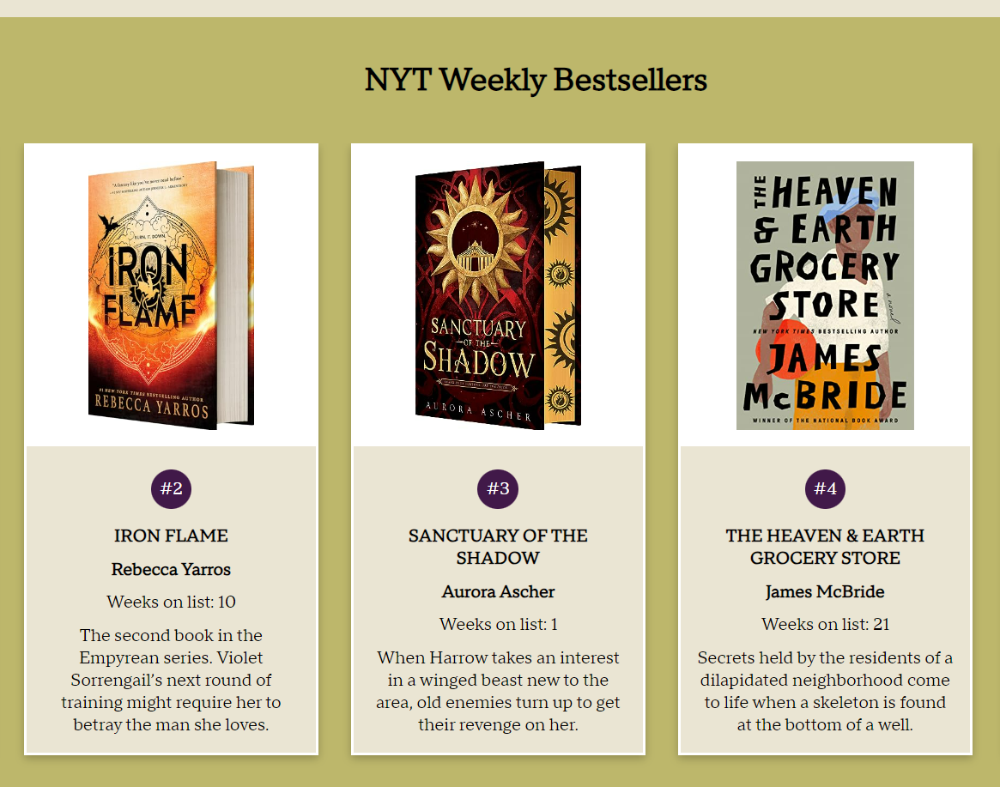
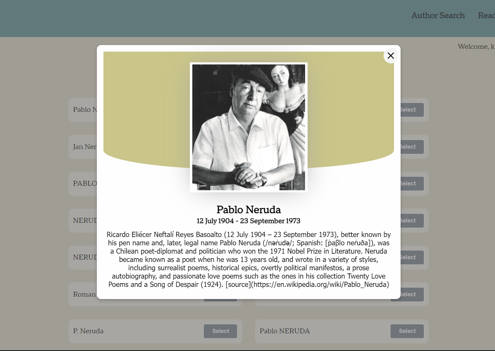
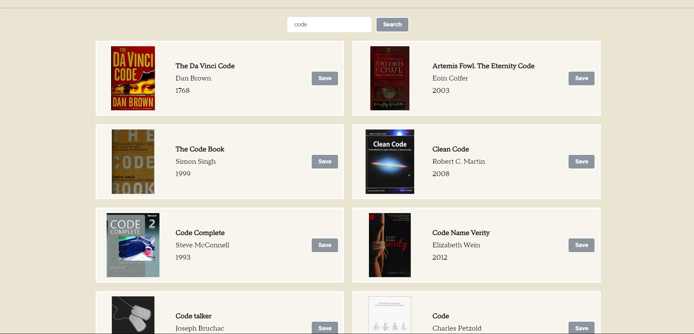
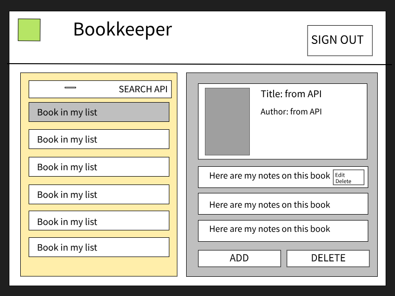

# About BOOKKEEP

(The fun type of bookkeeping)

This project is a full MERN-stack application and was designed as book resource/database. As it currently stands, the app incorporates four API endpoints and requires the user to sign-up & log-in in order to receive access. It also features full responsive design to accomodate different screen sizes.

It currently remains under development as I add new features. 

# Planning

For this project, I wanted to make something I would use. No matter how many times I move, I can't seem to pare down an impractically large number of much too heavy books. I started this project as a way to help me keep quickly keep track of the books I have read and want to read, and eventually, I want to add the ability to store personal notes that are linked to each book. 

Check out my project planning and user stories here: 
https://trello.com/b/sqyLZdBh

# Technologies Used

- Client-side interfacing via REACT
- Server and backend communication via EXPRESS and NodeJS
- Database storage and schemas via MONGODB
- JSON Web Tokens are used to assist in the verification of users
- React hooks utilized for API calls
- APIs provided by OpenLibrary and NYT Books

# Features

HOMEPAGE
The homepage contains a call to the NYT combined top sellers list, which is updated weekly. Book picture, title, author, description, as well as the number of weeks the book has been on the best-sellers list are displayed in a user-friendly card layout. 

AUTHOR SEARCH
An author search page which details selected author information in modal format upon user interaction. The modal adjusts to different screen sizes and displays a scrollbar as needed.

BOOK SEARCH
The book search allows users to search by whole or partial titles and accounts for special characters. Users can selected a book to add to their list which is displayed at the top of the screen in a familiar index card format, inspired by old school library checkout methods. The "addFave" function checks to see if a book with the same key from the api already exists on the readers list. 

USER DATA MANAGEMENT
Upon account creation, user information is added to the database and verifies that the user is registering with an email that is not already in the database. Upon logon, the database is checked to ensure that password for a given email is correct. 

# Problems and Solves

Initially I had difficulty connecting to my MongoDB and rendering my build. This problem was solved by using a legacy version of react-scripts. I could finally see my project! It was a pain, however, as I needed to run a build and start my server before *every* change. 

Author bios. Once the author modal element was created, my API seemed to be running into a issue with user images and author bios. I used a ternary statement to solve the issue with author image. For the author bios issue, I used the typeof operator to check if the author.bio json return was either an object or an array. 

# Unsolved Problems

Right now, there are no bugs in the app. However, I am still working on adding two features that I REALLY want.

1) USER BOOKS: Store the books a user selects to the database. Upon reload of the page, selected book information is lost.

2) BOOK NOTES: Eventually, I want to add a function that allows users create, update, read, and delete personal notes that are attached to a book. 

# Future Enhancements
See above for my main goals!

After those functions work, I plan to make the NYT homepage into a carousel (right now it has an x-scrollbar)

CSS cleanup, as always

Add quick access to readinglist/notes on homepage (below, Trello image from project planning stage for end goal)

